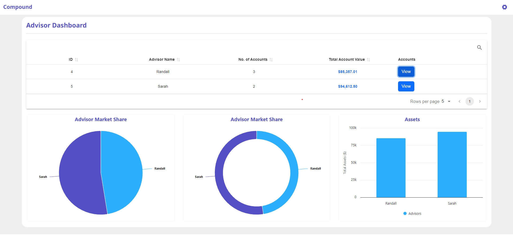
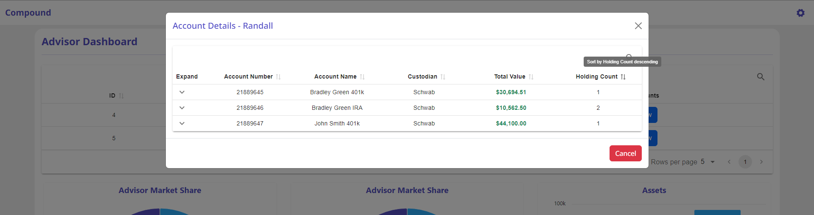
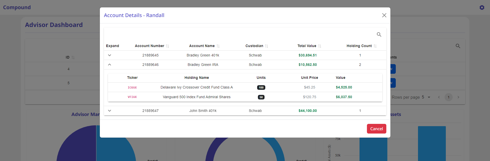
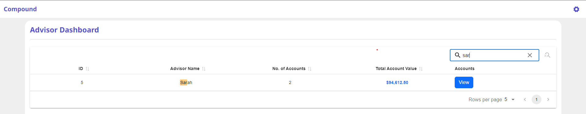
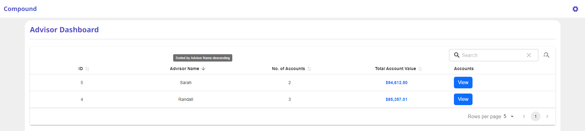

# Firm Advisor Dashboard

A Flask-React application to visualize advisor data, accounts, and holdings.


## Overview

Option B - Frontend emphasis

### Dashboard


The system uses a Flask backend API to serve data and a React frontend with MaterialReactTable, Reactstrap, Highcharts, Bootstrap.

## Features
### Accounts


### Holdings


### Search


### Sort


## Project Structure

```
anlytics-dashboard/
├── backend/
│   ├── app.py
│   ├── requirements.txt
│   ├── helper.py
│   └── data/
│       └── sample.json
├── frontend/
│   ├── src/
│   │   ├── components/
│   │   │   └── AccountsModal.jsx
│   │   │   └── AdvisorTable.jsx
│   │   │   └── AppNavbar.jsx
│   │   │   └── Chart.jsx
│   │   │   └── Dashboard.jsx
│   │   │   └── DonutChart.jsx
│   │   │   └── Holdings.jsx
│   │   │   └── PieChart.jsx
│   │   ├── services/
│   │   │   └── AdvisorService.jsx
│   │   ├── App.jsx
│   │   └── index.js
│   │   └── index.js
│   │   └── main.jsx
│   │   └── styles.css
│   ├── package.json
│   └── README.md
│   └── vite.config.js
└── ReadMe.md
```

## Prerequisites

### Python Setup

- Python 3.8 or higher
  - Download from [Python.org](https://www.python.org/downloads/)
  - Installation guides:
    - [Windows](https://docs.python.org/3/using/windows.html)
    - [macOS](https://docs.python.org/3/using/mac.html)
    - [Linux/UNIX](https://docs.python.org/3/using/unix.html)
  - Verify installation: `python --version`

### Node.js Setup

- Node.js 14 or higher
  - Download from [Node.js official website](https://nodejs.org/)
  - Installation guides:
    - Using Node Version Manager (recommended):
      - [nvm-windows](https://github.com/coreybutler/nvm-windows)
      - [nvm](https://github.com/nvm-sh/nvm) (for macOS/Linux)
    - Direct installation:
      - [Windows installer](https://nodejs.org/en/download/)
      - macOS: `brew install node` (using [Homebrew](https://brew.sh/))
      - Linux: Use your distribution's package manager
  - Verify installation:
    - `node --version`
    - `npm --version`

## Installation

### Backend Setup

1. Create and activate a virtual environment:

```bash
python -m venv venv
source venv/bin/activate  # On Windows: venv\Scripts\activate
```

2. Install Python dependencies:

```bash
cd backend
pip install -r requirements.txt
```

3. Run the Flask application:

```bash
python app.py
```

The backend will start on `http://localhost:5000`

### Frontend Setup

1. Install dependencies:

```bash
cd frontend
npm install
```

2. Start the development server:

```bash
npm run dev
```

The frontend will start on `http://localhost:5173`

## API Endpoints

### Advisors

- `GET /api/advisors` - Get all advisors with summary
- `GET /api/advisors/<advisor_id>/accounts` - Get accounts managed by an advisor

### Accounts

- `GET /api/accounts/<account_number>/holdings` - Get holdings for a specific account

## Frontend Components

### AdvisorDashboard

- Responsive layout using Reactstrap
- Sortable columns
- Currency formatting
- Error handling
- Nested table views

## Data Structure

### Advisor Object

```json
{
  "id": "string",
  "name": "string",
  "custodians": [
    {
      "name": "string",
      "repId": "string"
    }
  ],
  "accounts": ["string"]
}
```

### Account Object

```json
{
  "name": "string",
  "number": "string",
  "repId": "string",
  "custodian": "string",
  "holdings": [
    {
      "ticker": "string",
      "units": number,
      "unitPrice": number
    }
  ]
}
```

### Security Object

```json
{
  "id": "string",
  "ticker": "string",
  "name": "string",
  "dateAdded": "string"
}
```

## Development

### Backend

- Built with Flask
- Uses sample data
- Includes dynamic value calculations
- Returns JSON Response

### Frontend

- Built with React
- Uses MaterialReactTable for tabular data
- Included search, sort on advisor table
- Uses Reactstrap for layout, design
- Uses Bootstrap for styling
- Uses Highcharts for charts

### Future Enhancements

- Add authentication and authorization
- Add data export functionality
- Add database storage
- Add update, delete operations

## Author

- Sarah Ashraf Solkar
- email: ssolkar@gmu.edu
